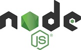
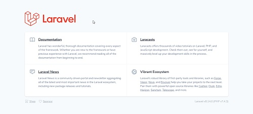

# Laravel-Social
Social media app written in Laravel\
Laravel is open source PHP framework.


# Composer:
https://getcomposer.org/
Dependency Manager for PHP\
for using laravel

**Composer installation:**
A. download installer from:\
https://getcomposer.org/Composer-Setup.exe

or 

B. install from terminal:
```
php -r "copy('https://getcomposer.org/installer', 'composer-setup.php');"
php -r "if (hash_file('sha384', 'composer-setup.php') === '756890a4488ce9024fc62c56153228907f1545c228516cbf63f885e036d37e9a59d27d63f46af1d4d07ee0f76181c7d3') { echo 'Installer verified'; } else { echo 'Installer corrupt'; unlink('composer-setup.php'); } echo PHP_EOL;"
php composer-setup.php
php -r "unlink('composer-setup.php');"
```

Installation:\
https://getcomposer.org/download/


Commands info if you run 'composer' on terminal:
```
   ______
  / ____/___  ____ ___  ____  ____  ________  _____
 / /   / __ \/ __ `__ \/ __ \/ __ \/ ___/ _ \/ ___/
/ /___/ /_/ / / / / / / /_/ / /_/ (__  )  __/ /
\____/\____/_/ /_/ /_/ .___/\____/____/\___/_/
                    /_/
Composer version 2.0.7 2020-11-13 17:31:06

Usage:
  command [options] [arguments]

Options:
  -h, --help                     Display this help message
  -q, --quiet                    Do not output any message
  -V, --version                  Display this application version
      --ansi                     Force ANSI output
      --no-ansi                  Disable ANSI output
  -n, --no-interaction           Do not ask any interactive question
      --profile                  Display timing and memory usage information
      --no-plugins               Whether to disable plugins.
  -d, --working-dir=WORKING-DIR  If specified, use the given directory as working directory.
      --no-cache                 Prevent use of the cache
  -v|vv|vvv, --verbose           Increase the verbosity of messages: 1 for normal output, 2 for more verbose output and 3 for debug

Available commands:
  about                Shows the short information about Composer.
  archive              Creates an archive of this composer package.
  browse               Opens the package's repository URL or homepage in your browser.
  cc                   Clears composer's internal package cache.
  check-platform-reqs  Check that platform requirements are satisfied.
  clear-cache          Clears composer's internal package cache.
  clearcache           Clears composer's internal package cache.
  config               Sets config options.
  create-project       Creates new project from a package into given directory.
  depends              Shows which packages cause the given package to be installed.
  diagnose             Diagnoses the system to identify common errors.
  dump-autoload        Dumps the autoloader.
  dumpautoload         Dumps the autoloader.
  exec                 Executes a vendored binary/script.
  fund                 Discover how to help fund the maintenance of your dependencies.
  global               Allows running commands in the global composer dir ($COMPOSER_HOME).
  help                 Displays help for a command
  home                 Opens the package's repository URL or homepage in your browser.
  i                    Installs the project dependencies from the composer.lock file if present, or falls back on the composer.json.
  info                 Shows information about packages.
  init                 Creates a basic composer.json file in current directory.
  install              Installs the project dependencies from the composer.lock file if present, or falls back on the composer.json.
  licenses             Shows information about licenses of dependencies.
  list                 Lists commands
  outdated             Shows a list of installed packages that have updates available, including their latest version.
  prohibits            Shows which packages prevent the given package from being installed.
  remove               Removes a package from the require or require-dev.
  require              Adds required packages to your composer.json and installs them.
  run                  Runs the scripts defined in composer.json.
  run-script           Runs the scripts defined in composer.json.
  search               Searches for packages.
  self-update          Updates composer.phar to the latest version.
  selfupdate           Updates composer.phar to the latest version.
  show                 Shows information about packages.
  status               Shows a list of locally modified packages.
  suggests             Shows package suggestions.
  u                    Upgrades your dependencies to the latest version according to composer.json, and updates the composer.lock file.
  update               Upgrades your dependencies to the latest version according to composer.json, and updates the composer.lock file.
  upgrade              Upgrades your dependencies to the latest version according to composer.json, and updates the composer.lock file.
  validate             Validates a composer.json and composer.lock.
  why                  Shows which packages cause the given package to be installed.
  why-not              Shows which packages prevent the given package from being installed.
```



## Node.js:
https://nodejs.org/en/
Node.js JS runtime is needed for frontend on Laravel


## Laravel:
https://laravel.com/

**Installing Laravel in terminal:**
```
composer global require laravel/installer
```

**Create new project**
```
laravel new LaravelSocialApp
```

**Go to project directory**
```
cd LaravelSocialApp
```

**To start php server**
```
php artisan serve
```
This will start php server and give address: http://127.0.0.1:8000 

Copy that address to webbrowser and open:


Displayed page is located on ./resources/views/welcome.blade.php

**On ERROR:** If something is already running on port 8000 and page won't open on browser try changing port for current project
```
php artisan serve --port 8001
```

**On ERROR:** If Avast antivirus detects false positive **SERVER.PHP** with virus **IDP.Generic**
Create exeption

**To create register and login for page run command on console**
```
php artisan make:auth
```

On 'Views' directory will be created directories 'auth', 'layouts' and file 'home.blade.php'

**On ERROR:** Command "make:auth" is not defined.
```
composer require laravel/ui
php artisan ui vue --auth
```

**To download current package dependencies run command:**
```
npm install
```

**On ERROR:** found 1 high severity vulnerability
```
npm audit fix
```

**On ERROR:** fixed 0 of 1 vulnerability
```
npm audit fix --force
```

**To compile project:**
```
npm run dev
```

'app.js' file is created inside ./public/js directory


## SQLite
https://www.sqlite.org/index.html
https://www.youtube.com/watch?v=XA3w8tQnYCA

1. download SQLite proper version(**'Tools'** NOT **'DLL'** files):
for example: sqlite-tools-win32-x86-3330000.zip

2. extract 3 files 'sqldiff.exe', 'sqlite3.exe' and 'sqlite3analyzer.exe' into *C:\Program Files (x86)\SQLite* folder

3. add System variable: \
System Properties > Environment Variables > System Variables > New > \
**Variable name:** sqlite
**Variable value:** C:\Program Files (x86)\SQLite\sqlite3.exe

4. add PATH to your system: \
System Properties > Environment Variables > System Variables > Path > Edit > *C:\Program Files (x86)\SQLite*


## Vim
https://www.vim.org/download.php#pc

1. download and install Vim

2. add PATH to your system: \
System Properties > Environment Variables > System Variables > Path > Edit *C:\Program Files (x86)\Vim\vim82*


## Creating database SQL for our project:
Run command on terminal to create database file inside 'database' directory:
```
vim database/database.sqlite
```

**On ERROR:** 'vim' is not recognized as an internal or external command
You need to install SQLite and Vim editor


## Artisan - Laravel PHP Console:
https://laravel.com/docs/8.x/artisan

To get Artisan commants run 'PHP artisan' on terminal:
```
Laravel Framework 8.14.0

Usage:
  command [options] [arguments]

Options:
  -h, --help            Display this help message
  -q, --quiet           Do not output any message
  -V, --version         Display this application version
      --ansi            Force ANSI output
      --no-ansi         Disable ANSI output
  -n, --no-interaction  Do not ask any interactive question
      --env[=ENV]       The environment the command should run under
  -v|vv|vvv, --verbose  Increase the verbosity of messages: 1 for normal output, 2 for more verbose output and 3 for debug

Available commands:
  clear-compiled       Remove the compiled class file
  down                 Put the application into maintenance / demo mode
  env                  Display the current framework environment
  help                 Displays help for a command
  inspire              Display an inspiring quote
  list                 Lists commands
  migrate              Run the database migrations
  optimize             Cache the framework bootstrap files
  serve                Serve the application on the PHP development server
  test                 Run the application tests
  tinker               Interact with your application
  up                   Bring the application out of maintenance mode
 auth
  auth:clear-resets    Flush expired password reset tokens
 cache
  cache:clear          Flush the application cache
  cache:forget         Remove an item from the cache
  cache:table          Create a migration for the cache database table
 config
  config:cache         Create a cache file for faster configuration loading
  config:clear         Remove the configuration cache file
 db
  db:seed              Seed the database with records
  db:wipe              Drop all tables, views, and types
 event
  event:cache          Discover and cache the application's events and listeners
  event:clear          Clear all cached events and listeners
  event:generate       Generate the missing events and listeners based on registration
  event:list           List the application's events and listeners
 key
  key:generate         Set the application key
 make
  make:cast            Create a new custom Eloquent cast class
  make:channel         Create a new channel class
  make:command         Create a new Artisan command
  make:component       Create a new view component class
  make:controller      Create a new controller class
  make:event           Create a new event class
  make:exception       Create a new custom exception class
  make:factory         Create a new model factory
  make:job             Create a new job class
  make:listener        Create a new event listener class
  make:mail            Create a new email class
  make:middleware      Create a new middleware class
  make:migration       Create a new migration file
  make:model           Create a new Eloquent model class
  make:notification    Create a new notification class
  make:observer        Create a new observer class
  make:policy          Create a new policy class
  make:provider        Create a new service provider class
  make:request         Create a new form request class
  make:resource        Create a new resource
  make:rule            Create a new validation rule
  make:seeder          Create a new seeder class
  make:test            Create a new test class
 migrate
  migrate:fresh        Drop all tables and re-run all migrations
  migrate:install      Create the migration repository
  migrate:refresh      Reset and re-run all migrations
  migrate:reset        Rollback all database migrations
  migrate:rollback     Rollback the last database migration
  migrate:status       Show the status of each migration
 notifications
  notifications:table  Create a migration for the notifications table
 optimize
  optimize:clear       Remove the cached bootstrap files
 package
  package:discover     Rebuild the cached package manifest
 queue
  queue:batches-table  Create a migration for the batches database table
  queue:clear          Delete all of the jobs from the specified queue
  queue:failed         List all of the failed queue jobs
  queue:failed-table   Create a migration for the failed queue jobs database table
  queue:flush          Flush all of the failed queue jobs
  queue:forget         Delete a failed queue job
  queue:listen         Listen to a given queue
  queue:restart        Restart queue worker daemons after their current job
  queue:retry          Retry a failed queue job
  queue:retry-batch    Retry the failed jobs for a batch
  queue:table          Create a migration for the queue jobs database table
  queue:work           Start processing jobs on the queue as a daemon
 route
  route:cache          Create a route cache file for faster route registration
  route:clear          Remove the route cache file
  route:list           List all registered routes
 schedule
  schedule:run         Run the scheduled commands
  schedule:work        Start the schedule worker
 schema
  schema:dump          Dump the given database schema
 session
  session:table        Create a migration for the session database table
 storage
  storage:link         Create the symbolic links configured for the application
 stub
  stub:publish         Publish all stubs that are available for customization
 vendor
  vendor:publish       Publish any publishable assets from vendor packages
 view
  view:cache           Compile all of the application's Blade templates
  view:clear           Clear all compiled view files
```


## Laravel Vapor:
https://vapor.laravel.com/
Serverless deployment platform for Laravel


